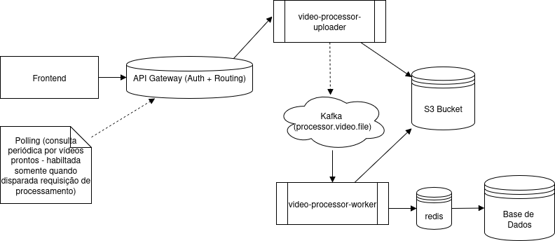
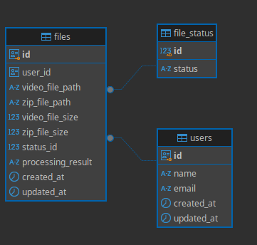

# video-processor
Este é o projeto principal do hackaton da fase final do curso "Software Architecture - SOAT" da FIAP.       
Trata-se de um processador de vídeos que gera um arquivo zip com os frames a cada segundo.


## arquitetura proposta



## Pilha Tecnológica Utilizada
- Containers: Docker + Docker Compose
- Mensageria: Apache Kafka
- Banco de Dados: PostgreSQL + Redis (cache)
- Monitoramento: Prometheus + Grafana
- CI/CD: GitHub Actions

## arquitetura proposta
- video-processor-front - pagina html estatica usando servidor de arquivos estaticos escritos em golang que acessa as APIs do sistema via api-gateway
- api-gateway - gateway que aciona os microserviços e prove a camada de autenticação básica
- microservico "video-processor-uploader" - recebe o arquivo de vídeo que deve estar nos formatos mp4, avi, mov, mkv, wmv, flv ou webm, grava ele em um bucket s3 e publica o identificador deste vídeo em um topico kafka "processor.video.file", para ser processado pelo microserviço "video-processor-worker"
- microservico "video-processor-worker" - consome mensagens do tópico "processor.video.file" e processa o vídeo gerando um arquivo do tipo .zip que conterá as imagens com 1 frame por segundo em formato png, este também será gravado no bucket s3 com um identificador único por usuário, que será gravado no banco dados postgres sql para posterior consulta no frontend

## base de dados



obs.: o script para criação da base de dados está em [db/migrations/V001__inti.sql](db/migrations/V001__init.sql) e já está configurado no docker-compose   

## links dos projetos relacionados
- [front](https://github.com/backstagefood/video-processor-front)
- [uploader](https://github.com/backstagefood/video-processor-uploader)
- [worker](https://github.com/backstagefood/video-processor-worker)

## links dos projetos no sonar cloud
- [front](https://sonarcloud.io/project/overview?id=backstagefood_video-processor-front)
- [uploader](hhttps://sonarcloud.io/project/overview?id=backstagefood_video-processor-uploader)
- [worker](https://sonarcloud.io/project/overview?id=backstagefood_video-processor-worker)

## executar localmente utilizando docker compose na raiz deste projeto

1. gerar imagens docker dos projetos video-processor-front, video-processor-uploader e video-processor-worker, utilizando o comando abaixo:
    ```shell
    make
    ```

2. gerar arquivo .env com o seguinte conteúdo: 
   ```env
   EMAIL_SENDER_FROM=
   EMAIL_SENDER_PASSWORD=
   ```

3. adicionar usuários para testes no api-gateway, caso seja necessário(os usuarios padrão são user@gmail e hfantin@gmail.com com senha de 1 a 6)
   > echo "novo_usuario@gmail.com:$(openssl passwd -apr1 123456)" >> api-gateway/.htpasswd

4. criar rede do docker com comando abaixo:   
   > docker network create video-processor

5. executar docker compose:   
    > docker compose up -d

6. acessar endereço do frontend: http://localhost:3000   

7. informar um dos usuários de testes com senha de 1 a 6(ou o novo usuário adicionado):    
   hfantin@gmail.com    
   user@gmail.com   

8. enviar um dos vídeos contidos na pasta [documentation/videos](documentation/videos):   
   video_amostra.mp4   
   video_erro.mp4   

9. aguardar o processamento, a lista com o resultado será atualizada automaticamente.   
   Caso finalize com sucesso, o link para o download do arquivo ficará visível,    
   em caso de erro, será exibida mensagem e um email será enviado ao usuário

10. link do grafana: 
    [localhost:3001](localstack:3001) 
    usuario: admin senha: admin
 

## executar localmente - sem docker compose - apenas para desenvolvimento
### pré-requisitos

- instalar ffmpeg

### configurações

1. **Criar arquivo .env na raiz do projeto video-processor-uploader com o conteúdo abaixo**

```.env
SERVER_PORT=9001
SWAGGER_HOST=localhost:9001
KAFKA_BROKER=localhost:9092
KAFKA_TOPIC=processor.video.file
AWS_ACCESS_KEY_ID=test
AWS_SECRET_ACCESS_KEY=test
AWS_REGION=us-east-1
S3_ENDPOINT=http://localhost:4566
S3_BUCKET_NAME=video-bucket
S3_USER=admin
S3_PASS=admin
GIN_MODE=release
```

2. **Criar arquivo .env na raiz do projeto video-processor-woker com o conteúdo abaixo**

```.env
SERVER_PORT=9002
SWAGGER_HOST=localhost:9002
MAX_VIDEOS=20
PROCESSING_DELAY=0
DB_USER=admin
DB_PASS=admin
DB_NAME=video_processor
DB_DRIVER=postgres
DB_HOST=localhost:5432
DB_OPTIONS=?sslmode=disable
KAFKA_BROKER=localhost:9092
KAFKA_TOPIC=processor.video.file
KAFKA_GROUP_ID=video-processor-group
AWS_ACCESS_KEY_ID=test
AWS_SECRET_ACCESS_KEY=test
AWS_REGION=us-east-1
S3_ENDPOINT=http://localhost:4566
S3_BUCKET_NAME=video-bucket
S3_USER=admin
S3_PASS=admin
GIN_MODE=release
EMAIL_FROM=your_email@gmail.com
EMAIL_PASSWORD=your_secret_password
```


