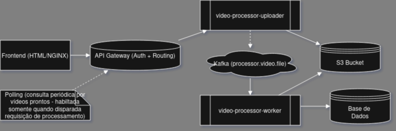

# video-processor

## pré-requisitos

- instalar ffmpeg

## configurações

1. **Criar arquivo .env na raiz do projeto back com o conteúdo abaixo**

```.env
SERVER_PORT=9000
SWAGGER_HOST=localhost:9000
DB_USER=admin
DB_PASS=admin
DB_NAME=video_processor
DB_DRIVER=postgres
DB_HOST=localhost:5432
DB_OPTIONS=?sslmode=disable
KAFKA_BROKER=localhost:9092
KAFKA_TOPIC=processor.video.file
KAFKA_GROUP_ID=video-processor-group
S3_ENDPOINT=http://localstack:4566
S3_BUCKET_NAME=video-bucket
AWS_REGION=us-east-1
S3_USER=admin
S3_PASS=admin
```

## executar no docker compose

1. criar rede do docker com comando abaixo:
    > docker network create video-processor
2. gerar imagens docker dos projetos back e front:

    ```shell
    make -C back docker-build
    make -C front docker-build
    ```

3. run docker compose:
    > docker compose up -d

## arquitetura proposta

- frontend - pagina html estatica exposta em container ngingx que acessa as APIs do sistema via gateway
- gateway de api - gateway que aciona os microserviços e prove a camada de autenticacao 
- microservico "video-processor-uploader" - recebe o arquivo de vídeo que deve estar nos formatos mp4, avi, mov, mkv, wmv, flv ou webm, grava ele em um bucket s3(gerar um identificador unico por cliente) e publica o identificador deste vídeo em um topico kafka "processor.video.file", para ser processado pelo microserviço "video-processor-worker"
- microservico "video-processor-worker" - observa topico "processor.video.file" e processa o vídeo gerando um arquivo do tipo .zip que conterá as imagens com 1 frame por segundo em formato png, este também será gravado no bucket s3 com um identificador único por usuário, que será gravado no banco dados postgres sql para posterior consulta no frontend

## desenho da arquitetura proposta




